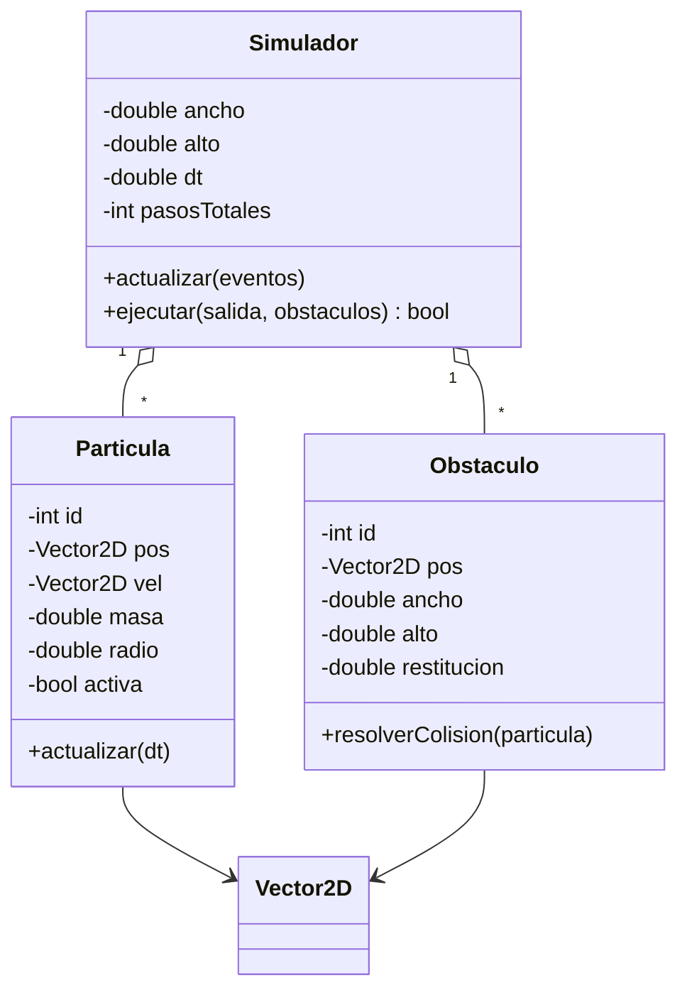
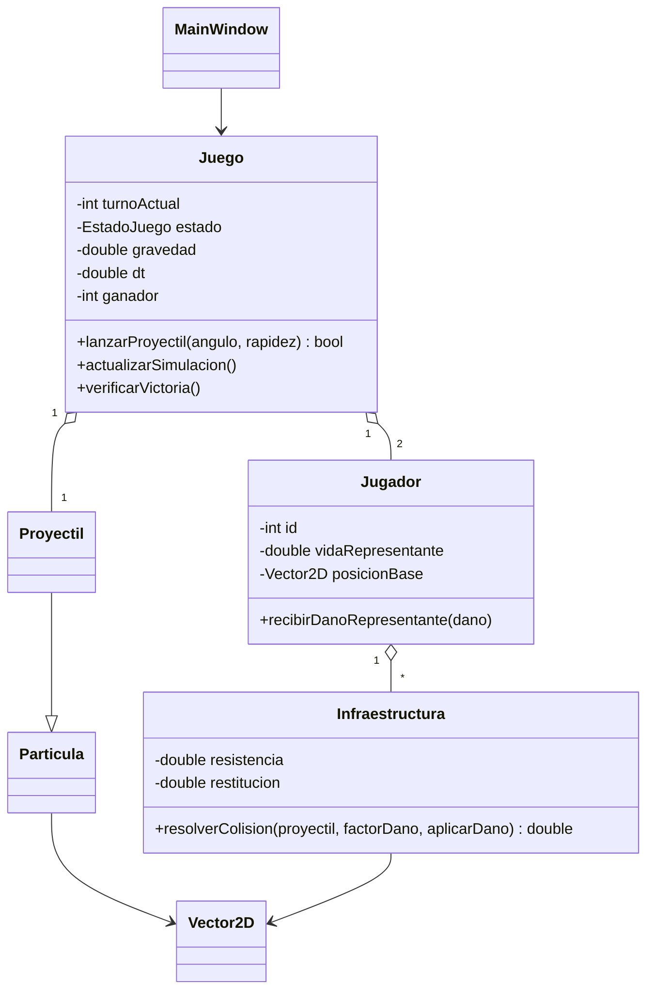

# Diagrama de clases — Práctica 5

## Actividad 1

```mermaid
classDiagram
 Simulador "1" o-- "*" Particula
 Simulador "1" o-- "*" Obstaculo
 Particula --> Vector2D
 Obstaculo --> Vector2D
 class Simulador {
  -double ancho
  -double alto
  -double dt
  -int pasosTotales
  +actualizar(eventos)
  +ejecutar(salida, obstaculos) bool
 }
 class Particula {
  -int id
  -Vector2D pos
  -Vector2D vel
  -double masa
  -double radio
  -bool activa
  +actualizar(dt)
 }
 class Obstaculo {
  -int id
  -Vector2D pos
  -double ancho
  -double alto
  -double restitucion
  +resolverColision(particula)
 }
```

## Actividad 2

```mermaid
classDiagram
 MainWindow --> Juego
 Juego "1" o-- "2" Jugador
 Juego "1" o-- "1" Proyectil
 Jugador "1" o-- "*" Infraestructura
 Proyectil --|> Particula
 Particula --> Vector2D
 Infraestructura --> Vector2D
 class Juego {
  -int turnoActual
  -EstadoJuego estado
  -double gravedad
  -double dt
  -int ganador
  +lanzarProyectil(angulo, rapidez) bool
  +actualizarSimulacion()
  +verificarVictoria()
 }
 class Jugador {
  -int id
  -double vidaRepresentante
  -Vector2D posicionBase
  +recibirDanoRepresentante(dano)
 }
 class Infraestructura {
  -double resistencia
  -double restitucion
  +resolverColision(proyectil, factorDano, aplicarDano) double
 }
```
